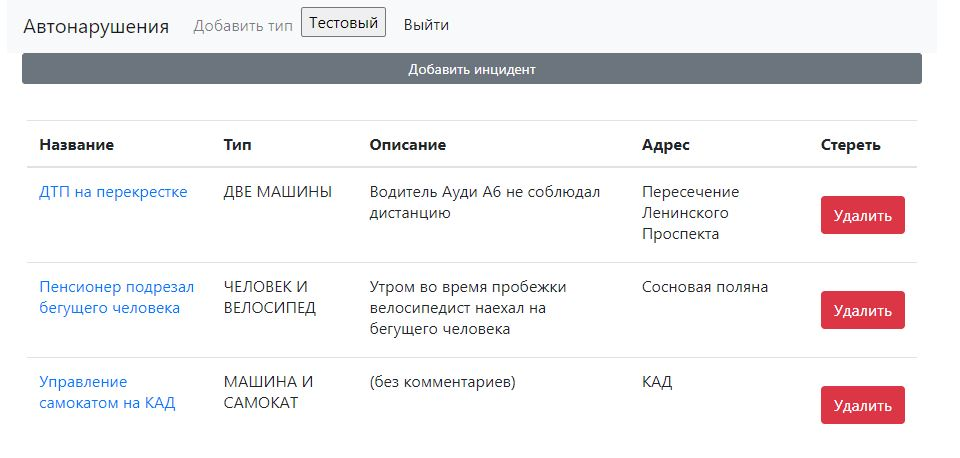
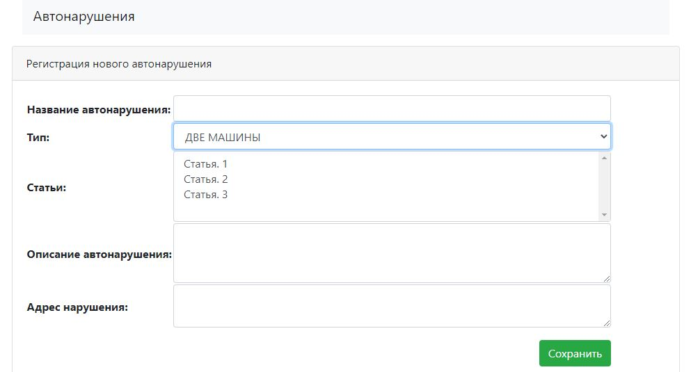

# job4j_car_accident

О проекте: В блоке Spring мы будем разрабатывать проект - Автонарушители.
Необходимо разработать систему для фиксации дорожно транспортных происшествий
Пользователь добавляет описание автонарушение.
В заявлении указывает: адрес, номер машины, описание нарушения и фотографию нарушения.
У заявки есть статус. Принята. Отклонена. Завершена.
Вид системы. Главная страница - это поиск с таблицей.

Сборка или установка:
собирается через Maven

Как использовать: пока просто смотреть)

Стек технологий: Maven, Spring boot,JSP, Spring Secutity,PostgreSQL, Hibernate.

Контакты:https:
//github.com/zweidmitr

Приложение сделано по типу записной книжки, для фиксации ДТП.
 - Внешний вид:
   
 - Возможность добавить инцидент
   